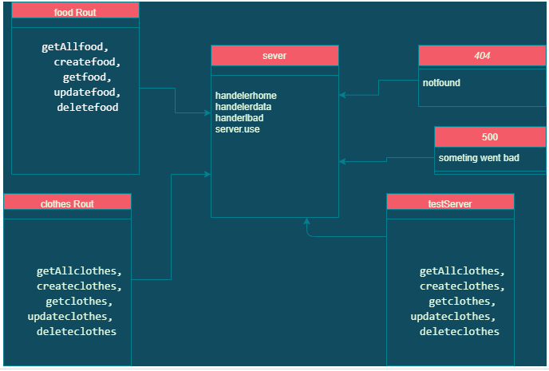

# basic-api-server
# Basic-express-server
## Author: Mohammad Haroun
just press on them 
* [Deployment Link (Heroku for food route) ](https://haroun-basic-api-server.herokuapp.com/food)

* [Deployment Link (Heroku for clothes route) ](https://haroun-basic-api-server.herokuapp.com/clothes)
* [Test Report Link ](https://github.com/Mohammad-Haroun-97/basic-api-server/actions)
* [Pull request Link ](https://github.com/Mohammad-Haroun-97/basic-api-server/pull/2)
# Setup
* .env requirements
* PORT - Port Number
* npm i sequelize sequelize-cli pg sqlite3
# Running the app
npm start

# Tests
Unit Tests: npm run test
## locally test working

# Working Diagram 

